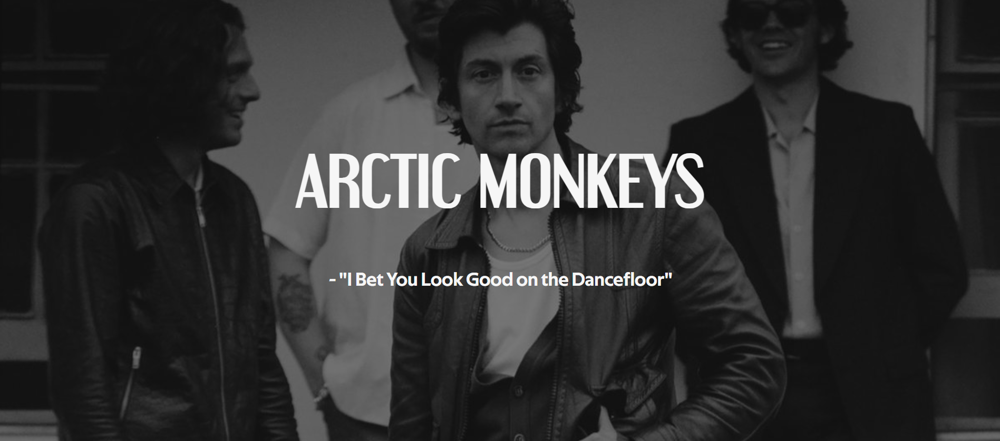

<h1>Memoria del proyecto fin de evaluación de Lenguaje de Marcas - 1º DAW</h1>
<h2>Arctic Monkeys - A tribute site</h2>

<h2>Índice</h2>
  <ul>
    <li><a href="#introduccion">Introducción<a/></li>
    <li><a href="#motivacion">Motivación<a/></li>
    <li><a href="#estructura">Estructura<a/></li>
    <li><a href="#estilo">Estilo<a/></li>
  </ul>
      
<h2 id="introduccion">Introducción</h2>

Trabajo realizado por: Sergio Gámez Ortega
  

Proyecto de web "from scratch" de 1º evaluación de Lenguaje de Marcas
  

Diciembre de 2023
  

<h2 id="motivacion">Motivación</h2>

El tema lo he elegido porque me parecía buena idea hacer una página sobre este banda de música de rock indie ya que su música es muy buena y un buen grupo, también porque es la banda favorita de un familiar.

<h2 id="estructura">Estructura</h2>

La página web esta dividida en 6 secciones:

<ul>
  <li>Hero Section</li>
  <li>Discografía</li>
  <li>Música</li>
  <li>Miembros</li>
  <li>Merchandising</li>
  <li>Footer</li>
</ul>

<h3>Hero Section</h3>

He tomado una imagen de fondo donde se ve al cantante principal de Arctic Monkeys en primer plano pudiendose ver perfectamente incluso para dispositivos móviles. Sobre ella he puesto en grande como título "ARCTIC MONKEYS" y un blockquote del título de una de sus canciones "I Bet You Look Good on the Dancefloor"

<h3>Discografía</h3>

He tomado una imagen de cada uno de los discos/albums de Arctic Monkeys y he creado una galería de fotos con un estilo acordeón

<h3>Música</h3>

He colocado 3 vídeos de YouTube utilizando un grid de 3 columnas.

<h3>Miembros</h3>

He colocado de manera independiente a cada miembro de Arctic Monkeys separados utilizando un grid de 2 columnas separando su respectiva imagen con su texto.

<h3>Merchadising</h3>

En esta sección he colocado una serie de productos de compra oficiales de Arctic Monkeys colocados utilizando un grid de 3 columnas.

<h3>Footer</h3>

En el footer de la página he utilizado otro grid de 3 columnas colocando en una imágen del logo de Arctic Monkeys, una repetición de la barra de navegación junto a otro enlace a la página oficial de Arctic Monkeys y sus redes sociales. Abajo de este he puesto el proposito con el que se ha creado la página y de quienes son las imagenes, música y merchandising utilizados.

<h2 id="estilo">Estilo</h2>
<h3>Paleta de colores</h3>

He utilizado esta paleta de colores intercalando entre colores claros, medio claros y mas oscuros.

<h3>Tipografías</h3>

He utilizado 2 fuentes de tipografía, una para los títulos y otra para el texto.

<ul>
  <li><a href="https://www.1001fonts.com/search.html?search=Engebrechtre+Regular">Engebrechtre Regular</a>
(Títulos)
</li>
  <li><a href="https://www.1001fonts.com/search.html?search=Techna+Sans+Regular">Techna Sans Regular</a>
(Texto)
</li>
</ul>
